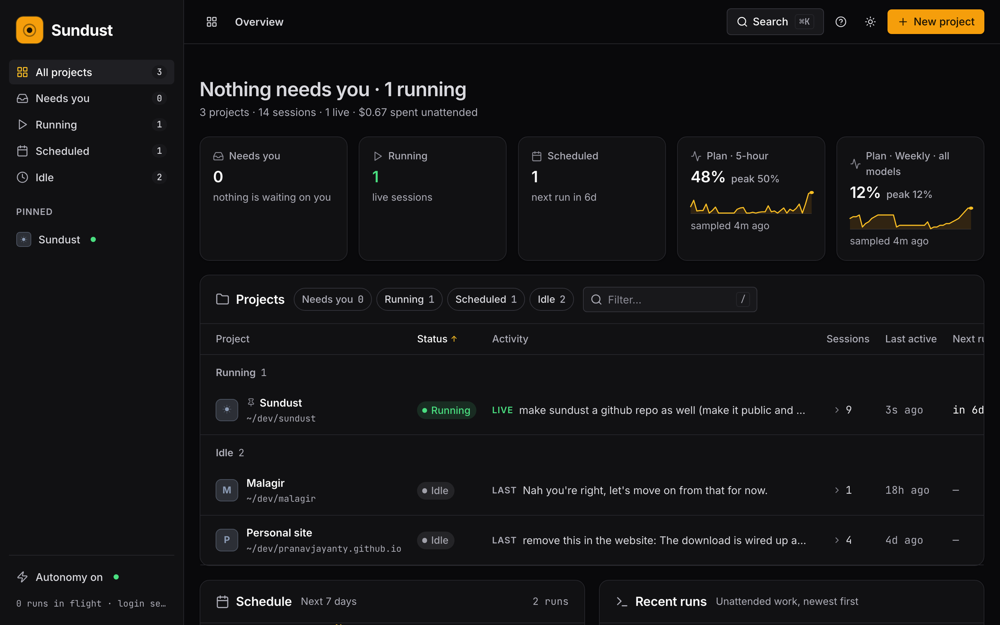

# Sundust

Mission control for the projects you run with Claude Code.

Sundust watches every project you work on with a coding agent, shows you what needs your attention, and keeps projects moving on a schedule while you are away. It runs on your Mac, reads the transcripts Claude Code already writes, and never sends anything anywhere.



## What it does

- **One screen for every project.** A table of your projects with status, what each one is doing or waiting on, session count, last activity and next scheduled run. Sort, filter, and group by status.
- **Tells you what needs you.** Questions an agent stopped on, sessions waiting at a prompt, and failed runs are surfaced first. Answer a question from the console and the agent carries on by itself.
- **Reopens any session.** Every transcript is listed per project. One click resumes it in the Claude Code app. Or send it a message from the console and it continues headless, in the same session.
- **Runs work on a schedule.** Each project has an agenda: cron tasks that run headless in that folder. Add, enable, disable and run them from the console. Every run is a resumable session with its result, cost and turns recorded.
- **Reviews unattended edits.** Before a run that may write, Sundust checkpoints the project. Afterwards you see exactly which files changed, with line counts, and can keep or revert them. Revert never touches a file you edited since the run.
- **Spends your plan carefully.** The scheduler reads your Claude usage before starting anything, holds low-priority tasks as the weekly window fills, and waits while you are actively working.
- **Connects projects.** A run can raise an event. Projects that listen for that event get a run of their own, with the context.
- **Works from your phone.** Serve it over Tailscale, add it to your home screen, and do everything except open the desktop app.

## Requirements

- macOS. The login service and the links into the desktop app are macOS only. The console itself runs anywhere Node runs.
- Node.js 20 or newer.
- [Claude Code](https://claude.com/claude-code), signed in.

## Install and run

```bash
git clone https://github.com/pranavjayanty/sundust.git
cd sundust
node bin/sundust.js up
```

That opens the console at http://127.0.0.1:4173 and starts the scheduler. Sundust finds the folders Claude Code already has sessions for and offers to track them. `npm link` puts a `sundust` command on your PATH so you can drop `node bin/`.

**Keep it running after you close the terminal.** The scheduler only fires while Sundust is running, so register it as a login service:

```bash
sundust install      # starts at login, restarts if it stops, logs to ~/.sundust/log
sundust service      # is it installed and running?
sundust logs         # last 80 lines
sundust uninstall
```

**Let unattended runs authenticate.** An interactive `claude` login expires within a day. Mint a long-lived token and store it with Sundust so runs work from any shell, including launchd:

```bash
claude setup-token
sundust auth         # paste the token; input is hidden
```

## The console

**Status.** Every project is in exactly one state.

| State | Meaning |
|---|---|
| Needs you | A run stopped on a question, a session is waiting at the prompt, or the last run failed |
| Running | A live session or a headless run is working right now |
| Scheduled | Nothing running, but agenda tasks will fire on their own |
| Idle | Nothing running and nothing scheduled |
| Archived | Shelved. Nothing runs and it stays out of the counts |

**Activity column.** The most urgent true thing about the project: the question an agent is waiting on, the subject of the live session, the running or next scheduled task, or the summary of the last run.

**Project panel.** Click a project to open it. The panel has six tabs:

| Tab | What is there |
|---|---|
| Overview | The open question with the context the agent had, and a box to answer it. The reply continues the same session headless. |
| Sessions | Every transcript. Open it in the app, or Continue it with a message. |
| Agenda | Each task with an on/off switch, its schedule in words, priority and next run. Run now, remove, or add a task with a cron expression and a prompt. |
| Runs | Every recent run with its full result or error, cost, turns, and whether its edits are waiting in Review. |
| Notes | The notes the project has accumulated, and the events it has raised or listens for. |
| Settings | Autonomy level, events to listen for, pin, archive, stop tracking. |

**Review.** When a run with edit autonomy changes files, they appear in a Review card at the top with per-file line counts and Keep / Revert buttons.

**Search.** Press `⌘K` (or `Ctrl K`) for a command palette over projects, sessions, agenda tasks and templates.

**Keyboard.** `n` new project, `/` filter, `t` theme, `?` cheat sheet. In the project table, `↑` `↓` move between rows, `→` reaches a row's actions, `↵` opens the panel. In a reply box, `⌘↵` sends.

**Display.** Dark and light themes. A compact / comfortable / spacious type-size switch in the cheat sheet. Add `?theme=dark` or `?theme=light` to the URL to force one for that load.

## How unattended runs work

**Autonomy.** Set per project. New projects default to `read`.

| Level | What a scheduled run may do |
|---|---|
| `off` | Nothing runs unattended |
| `read` | Read and report. Writes and shell are denied |
| `edit` | Change files in the project. Every change is checkpointed and goes to Review |

The scheduler also skips any project that has a live interactive session, and there is a fleet-wide switch in the sidebar that pauses everything.

**The contract.** Every project Sundust creates gets a `CLAUDE.md` that teaches the agent three lines:

```
NEEDS INPUT: <one self-contained question>   when a decision needs you
NOTE: <one line>                             something that should outlive this run
EMIT: <event-name> <context>                 another project now has something to do
```

Questions become Needs-you items you can answer from the console. Notes accumulate per project and every later run reads them first. Events start runs in the projects that listen for them.

**Answering from the console.** A reply is sent with `claude -p --resume <session>`, so the agent continues with its full context. The reply is recorded as a run, and the question is marked resolved.

**Checkpoints and review.** Before any run that may write, Sundust records the git HEAD and the content of anything already modified. After the run it records which files changed and their hashes. Revert restores each file to its pre-run content and refuses any file that changed again after the run, reporting those back instead of overwriting your work. It never rewrites history and never touches the index. A project with `edit` autonomy but no git repository is marked unprotected, because there is nothing to checkpoint against.

**Plan budget.** The scheduler reads the same usage numbers the Claude app shows and applies these thresholds (all in `settings.json`):

| Setting | Default | Effect |
|---|---|---|
| `budget.pauseLowAbove` | 50 | Low-priority tasks stop when the weekly window passes this percentage |
| `budget.pauseNormalAbove` | 78 | Normal tasks stop here |
| `budget.pauseAllAbove` | 93 | Only critical tasks run above this |
| `budget.busyThreshold` | 40 | If your 5-hour window is above this, you are working; unattended runs wait |

Anything held back is listed under the schedule with the reason.

**Reading outside the project.** A project can list `extraDirs`, and a task can list `dirs`. Both become `--add-dir` on the run, so a read-only run can look at data that lives elsewhere without stopping to ask.

**Claude Code's own scheduled tasks** (`~/.claude/scheduled-tasks`) are shown in the agenda with a `claude` badge. Sundust does not run them; the desktop app does.

## July: the secretary you text

July is an agent you talk to over iMessage. Text yourself, and July answers with what it knows about your projects and sessions, does what you ask, and texts you first when something needs you.

What July can do:

- Answer questions. "What is Ledger doing?" "Anything waiting on me?" "What did the last run in Malagir say?"
- Ping you. When a run stops on a question, a session is waiting at a prompt, or a run fails, July texts you the question and the context the agent had. Reply in plain English and July sends your answer back to that run, which carries on headless.
- Act. Continue any session with a message, run an agenda task or a one-off prompt, pause or resume the fleet, open a session in the app on the Mac. Each action is validated against what July was shown; it cannot run shell commands, touch files, or invent an id.
- Follow up. When a run July started finishes, it texts you the result.

July runs on a cheap model (Haiku by default) through the Claude Code CLI, so it costs plan usage and needs no API key. It keeps one conversation going so it remembers context, and starts a fresh one after 40 exchanges.

Setup, on the Mac:

1. Grant Full Disk Access to the app you run Sundust from (System Settings, Privacy & Security, Full Disk Access, add Terminal or iTerm). July reads the Messages database and macOS does not allow that otherwise.
2. Pair. Run `sundust july pair`, then text yourself the word `july` from your phone. The chat that text arrives in becomes July's handle.
3. `sundust july test` sends a hello. macOS asks once to allow Sundust to control Messages.
4. `sundust july` starts listening. It needs `sundust up` running.

```bash
sundust july pair
sundust july test
sundust july
sundust july status
sundust july model sonnet   # if Haiku is not enough
```

Only texts from the paired handle are read, and only ones sent after July started. July's own texts begin with ☀︎ so it never replies to itself.

## From your phone

Nothing has to move. The Mac keeps running everything; the phone is a remote control. Everything headless works remotely: answering, continuing sessions, editing and running the agenda, reviewing edits, pausing the fleet. Only the buttons that open the desktop app are Mac-only, and the console labels them "on Mac" when you are remote.

The recommended path is [Tailscale](https://tailscale.com), which gives your devices a private network with TLS and identity and exposes nothing to the internet:

```bash
brew install --cask tailscale      # once; open the app and log in
sundust install                    # Sundust runs at login
sundust remote setup               # serve over your tailnet and allow its hostname
```

`remote setup` runs `tailscale serve --bg 4173`, reads your MagicDNS name, adds it to the allowed hosts, and prints the `https://` URL to open on your phone. Then use Add to Home Screen. If Serve or HTTPS is not yet enabled on your tailnet, it prints the one-click link to enable it.

The server never binds to anything but `127.0.0.1`. Tailscale terminates the connection on the Mac and forwards it. Keep the Mac awake, or run `caffeinate -s`.

## Security

The API is on `127.0.0.1`, but a web page you have open could still send it requests. Sundust refuses those:

- The `Host` header must be a loopback name or one you added with `sundust remote add`.
- Anything that changes state must be JSON and carry an `x-sundust-client` header. A custom header forces a browser preflight, and the preflight is answered with no permission.
- `PATCH /api/project` and `PATCH /api/settings` accept only the fields the console needs. The binary that gets executed, the project path, and the remote hosts are set from the CLI or `settings.json`, never over HTTP.

Calling the API from a script:

```bash
curl -X POST http://127.0.0.1:4173/api/run \
  -H 'content-type: application/json' -H 'x-sundust-client: 1' \
  -d '{"projectId":"…","prompt":"…"}'
```

## Configuration

State lives in `~/.sundust`. Nothing in `~/.claude` is ever written to.

| File | Contents |
|---|---|
| `projects.json` | The projects you track, their agendas and settings |
| `settings.json` | Port, workspace root, concurrency, timeouts, budget thresholds, remote hosts, July |
| `july.json` | July's conversation id, message cursor, and what it has already pinged you about |
| `runs/` | One JSON record per unattended run |
| `notes/` | Per-project notes written by runs |
| `asks.json` | Open and answered questions |
| `events.jsonl` | Cross-project events |
| `credentials.json` | The long-lived token from `sundust auth`, mode 600 |
| `log/` | Output of the login service |

Set `SUNDUST_HOME` to use a different directory.

## CLI

| Command | What it does |
|---|---|
| `sundust up` | Console and scheduler |
| `sundust serve` | Console only |
| `sundust daemon` | Scheduler only |
| `sundust install` / `uninstall` / `service` / `logs` | Login service |
| `sundust new <name> [--template t] [--autonomy a]` | Scaffold a project and open Claude Code in it |
| `sundust adopt [dir]` | Track an existing folder |
| `sundust relocate <match> <dir>` | Point a project at a folder you moved, keeping its session history |
| `sundust ls` | List projects and status |
| `sundust next` | Open whatever is waiting on you |
| `sundust go [match]` | Open a project's most relevant session |
| `sundust run <match> [prompt]` | Run an agenda task, or a prompt, headless now |
| `sundust auth` | Store a long-lived token |
| `sundust remote setup` / `add` / `remove` | Reach the console from other devices |
| `sundust july` / `pair` / `test` / `status` / `model` | The secretary you text |

Templates: `blank`, `finance`, `recipes`, `fitness`, `journal`. Each one scaffolds a folder, a `CLAUDE.md` brief, and an agenda that starts running on its own.

## Harnesses

Claude Code is the default and the only fully supported harness: transcript indexing, live-session detection, links into the app, headless runs and resume, cost accounting. Codex CLI, Gemini CLI and OpenCode can be scheduled and run headless, but their sessions are not indexed and cannot be reopened from the console. A harness is one entry in `src/harnesses.js`.

## Tests

```bash
npm test
```

`node --test`, no dependencies, against a throwaway `SUNDUST_HOME`. The important one is `test/checkpoint.test.js`: a run edits one file and creates another, you then edit the first one yourself, and revert must restore the second and refuse the first. The API suite proves the request guard above.

## Project layout

```
bin/sundust.js     CLI
src/server.js      HTTP API, live updates, request guard
src/autonomy.js    cron, headless runner, questions, notes, events, budget
src/checkpoint.js  git checkpoint, diff, verdict, revert
src/scan.js        incremental transcript indexer and live-process detection
src/projects.js    registry, scaffolding, relocation, discovery
src/harnesses.js   harness definitions
src/service.js     launchd login service, Tailscale
src/july.js        the secretary: Messages reader, digest, actions, loop
src/templates.js   project templates
web/               the console: vanilla ES modules, no build step
test/              node:test suites
```

## License

MIT. Inter and JetBrains Mono are vendored under `web/fonts` under the SIL Open Font License.
